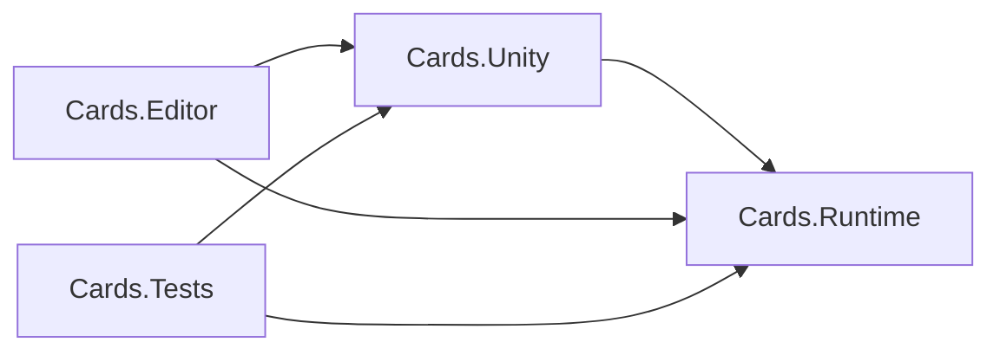
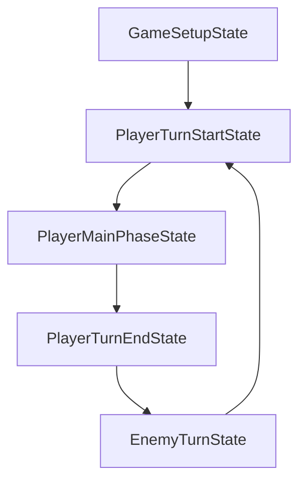

# Cards 架构现状与调用链梳理

## 1. 文档目的

这份文档基于当前 `Assets/Cards/` 下的实际代码，而不是基于重构计划的目标态，回答三个问题：

1. 当前 `Cards.Runtime / Cards.Unity / Cards.Editor / Cards.Tests` 四个程序集分别负责什么。
2. 游戏启动、回合推进、抽牌、出牌、规则处理、伤害、死亡、布局同步这些关键链路现在是怎么跑通的。
3. 在这些调用链中，哪些边界已经成立，哪些地方仍然存在职责穿透、过渡态设计或未闭环问题。

本文默认“当前状态”指 2026-04-01 这次 review 时工作区中的代码。

---

## 2. 程序集职责总览

### 2.1 `Cards.Runtime`

定位：纯逻辑层、服务抽象层、规则链与核心领域对象层。

当前承载内容：

- 核心领域对象
  - `CardInstance`
  - `CardModel`
  - `CardOwner`
  - `CardZone`
  - `ZoneRegistry`
  - `ZoneTransferService`
- 战斗与动作抽象
  - `ICombatable`
  - `DiceRoller`
  - `CombatResolver`
  - `GameAction`
  - `DamageAction`
- 规则系统
  - `InteractionRequest`
  - `IInteractionRule`
  - `RuleEngine`
  - `AttackRule`
  - `PlayEffectRule`
  - `PlayEntityRule`
  - `CardDispositionRule`
- 服务抽象与上下文
  - `GameContext`
  - `IRandom`
  - `ILogger`
  - `IAnimationPolicy`
  - `IActionQueue`
  - `IEventBus`
  - `IZoneRegistry`
  - `IRuleEngine`
  - `IInputProvider`
  - `ITimeProvider`
- 事件与运行时状态机抽象
  - `EventBus`
  - `RequestMoveCardEvent`
  - `CardClickedEvent`
  - `CardDiedEvent`
  - `GameStateMachine`
  - `IState`
- 纯数据接口
  - `ICardData`
  - `ICardEffect`
  - `CardTag`
  - `ZoneId`

职责边界：

- 不依赖 `UnityEngine`
- 定义游戏领域模型和服务接口
- 承载“规则判断、状态迁移、动作入队、伤害结算、区域转移”这些业务逻辑
- 不负责 GameObject 生命周期、Inspector 序列化、视觉表现和输入实现

### 2.2 `Cards.Unity`

定位：Unity 宿主层、组合根、视图层、平台适配层、当前遗留的部分业务实现层。

当前承载内容：

- 宿主与组合根
  - `GameManager`
  - `ActionManager`
- Unity 平台适配
  - `UnityRandom`
  - `UnityLogger`
  - `UnityInputProvider`
  - `UnityTimeProvider`
  - `LiveAnimationPolicy`
  - `InstantAnimationPolicy`
- 视图与场景对象
  - `CardEntityView`
  - `LevelZoneSetup`
  - `ZoneLayoutView`
  - `IZoneLayout`
  - `LineLayout`
  - `PileLayout`
- Unity 侧回合状态
  - `GameSetupState`
  - `PlayerTurnStartState`
  - `PlayerMainPhaseState`
  - `PlayerTurnEndState`
  - `EnemyTurnState`
- 事件处理器
  - `CardPlayHandler`
  - `CardDeathHandler`
- 数据资源与配置
  - `CardData`
  - `DeckConfig`
  - `LevelConfig`
  - `ZoneConfigData`
- 当前仍留在 Unity 层的效果/动作实现
  - `DrawCardAction`
  - `ReshuffleAction`
  - `DamageEffect`
  - `AOEDamageEffect`
  - `DrawCardEffect`

职责边界：

- 负责把 Unity 世界组装成可运行的 `GameContext`
- 负责场景对象、输入、时间、日志、随机数、动画协程
- 负责逻辑对象与视图对象之间的桥接
- 当前仍然承担了部分“效果业务逻辑”和“动作实现”，这是现阶段最主要的边界穿透点

### 2.3 `Cards.Editor`

定位：编辑器扩展层。

当前承载内容：

- `CardEffectDrawer`
- `DeckConfigEditor`

职责边界：

- 只服务编辑器体验、资源编辑和 Inspector 展示
- 不参与运行时调用链

### 2.4 `Cards.Tests`

定位：当前的统一测试层。

当前承载内容：

- Runtime 逻辑测试
  - `DiceRollerTests`
  - `CombatResolverTests`
  - `CardZoneTests`
  - `RuleEngineTests`
- 混合层测试
  - `ActionLogicTests`
  - `GameFlowTests`

职责边界现状：

- 当前测试程序集同时引用 `Cards.Runtime` 和 `Cards.Unity`
- 它能验证“整体重构后还能跑通的关键逻辑”
- 但它不能单独证明“Runtime 可以在不接触 Unity 侧类型的情况下完全独立测试”

---

## 3. 程序集依赖方向

当前 asmdef 依赖方向如下：

结论：

- 编译层面的主边界已经建立：`Cards.Runtime` 不引用 Unity。
- 运行时的主要反向穿透点不在 asmdef 层，而在“Runtime 接口由 Unity 侧具体实现承载”的对象图中，尤其是 `ICardEffect`。

---

## 4. 核心对象与职责分层

### 4.1 领域对象

- `CardInstance`
  - 逻辑上的一张牌
  - 持有 `CardModel`
  - 跟踪 `Owner`、`CurrentZone`、`CurrentZoneId`
- `CardModel`
  - 维护战斗数值与生命状态
  - 实现 `ICombatable`
- `CardZone`
  - 纯逻辑区域容器
  - 负责 Add / Remove / Draw / Shuffle
  - 对外发出 `OnCardAdded / OnCardRemoved / OnShuffled`

### 4.2 宿主与桥接对象

- `GameManager`
  - Unity 组合根
  - 创建 `GameContext`
  - 创建状态机、处理器、区域引用、初始牌组实例
- `ActionManager`
  - Unity 协程驱动的动作队列
  - 负责“逻辑执行 + 动画等待”的宿主流程
- `CardEntityView`
  - 卡牌视图对象
  - 负责显示、点击、移动动画
- `ZoneLayoutView`
  - 监听 `CardZone` 事件并驱动布局

### 4.3 规则与动作对象

- `RuleEngine`
  - 汇总规则、排序、验证、执行、默认移动
- `GameAction`
  - 逻辑阶段 `Execute(GameContext)`
  - 动画阶段 `AnimateRoutine()`
- `DamageAction`
  - 已在 Runtime
- `DrawCardAction` / `ReshuffleAction`
  - 仍在 Unity 程序集
  - 逻辑上已大量依赖 `GameContext`
  - 动画阶段直接使用 Unity 协程

### 4.4 数据与效果对象

- `ICardData`
  - Runtime 侧纯数据接口
- `CardData`
  - Unity 侧 ScriptableObject 配置
- `ICardEffect`
  - Runtime 侧效果接口
- `DamageEffect` / `AOEDamageEffect` / `DrawCardEffect`
  - 仍在 Unity 层
  - 当前不仅是配置对象，也承担业务执行逻辑

---

## 5. 启动与组合根调用链

### 5.1 `GameManager.Awake()` 组装运行时

调用链：

1. Unity 创建 `GameManager`
2. `GameManager.Awake()`
3. 查找或创建 `ActionManager`
4. 创建平台实现
   - `UnityRandom`
   - `UnityLogger`
   - `UnityInputProvider`
   - `UnityTimeProvider`
   - `LiveAnimationPolicy` 或 `InstantAnimationPolicy`
5. 创建 Runtime 服务实例
   - `ZoneTransferService`
   - `RuleEngine`
   - `EventBus`
   - `ZoneRegistry`
6. 用以上对象构造 `GameContext`
7. `ActionManager.Initialize(Context)`
8. 创建 `GameStateMachine`
9. 创建 Unity 侧状态对象
10. 订阅 `RequestMoveCardEvent`
11. 创建 `CardPlayHandler`
12. 创建 `CardDeathHandler`

程序集职责拆分：

| 步骤 | 主要类型 | 程序集 | 责任 |
|---|---|---|---|
| 组合根 | `GameManager` | `Cards.Unity` | 负责对象图组装 |
| 服务抽象 | `GameContext` | `Cards.Runtime` | 统一依赖入口 |
| 平台实现 | `UnityRandom/Logger/Input/Time` | `Cards.Unity` | 为 Runtime 服务接口提供 Unity 实现 |
| 事件总线/区域注册/规则引擎 | `EventBus/ZoneRegistry/RuleEngine` | `Cards.Runtime` | 负责核心运行时服务 |

结论：

- 这条链路已经比较清晰，`GameManager` 真正成为了组合根。
- 核心依赖不再从任意业务代码处全局抓取，而是从 `GameContext` 注入。

---

## 6. 场景区域初始化调用链

### 6.1 `GameSetupState` 触发初始化

调用链：

1. `GameManager.Start()`
2. `StateMachine.Initialize(GameSetupState)`
3. `GameSetupState.Enter()`
4. `gm.InitializePiles()`
5. `levelSetup.InitializeZones(Context)`
6. `LevelZoneSetup` 读取 `LevelConfig`
7. 根据 `ZoneConfigData` 找场景 anchor
8. 创建 `IZoneLayout`
9. 创建纯逻辑 `CardZone`
10. 如有布局则创建 `ZoneLayoutView`
11. `GameManager` 从 `LevelZoneSetup` 拉取快捷引用
12. `GameManager` 把所有 zone 注册到 `Context.Zones`
13. `GameManager` 给默认战场区挂规则

程序集职责拆分：

| 步骤 | 主要类型 | 程序集 | 责任 |
|---|---|---|---|
| 状态推进 | `GameSetupState` | `Cards.Unity` | 驱动初始化时机 |
| 场景绑定 | `LevelZoneSetup` | `Cards.Unity` | 把配置和场景锚点绑定 |
| 逻辑区域 | `CardZone` | `Cards.Runtime` | 承载区域状态 |
| 布局同步器 | `ZoneLayoutView` | `Cards.Unity` | 把 zone 事件转成视觉布局 |
| 注册服务 | `IZoneRegistry/ZoneRegistry` | `Cards.Runtime` | 提供全局 zone 查找 |

当前边界现状：

- `CardZone` 的纯逻辑化已经成立。
- 多实例 zone 的“创建和注册”已经成立。
- 但多实例 zone 的“上层消费链”还没有完全成立，见第 16 节。

---

## 7. 初始牌组创建调用链

调用链：

1. `GameSetupState.Enter()`
2. `gm.InitializeDeck()`
3. 遍历 `DeckConfig.cards`
4. Unity 实例化 `cardPrefab`
5. 获取 `CardEntityView`
6. 创建 Runtime `CardInstance`
7. `CardEntityView.SetupCard(cardInstance, context)`
8. `LevelZoneSetup.RegisterCardView(cardInstance, cardView)`
9. 把 `CardInstance` 加入 `drawPile`
10. `drawPile.Shuffle(Context.Random)`

程序集职责拆分：

| 步骤 | 主要类型 | 程序集 | 责任 |
|---|---|---|---|
| 卡牌配置 | `CardData` / `DeckConfig` | `Cards.Unity` | 提供资源数据 |
| 逻辑身份 | `CardInstance` | `Cards.Runtime` | 生成可参与规则系统的牌 |
| 视觉对象 | `CardEntityView` | `Cards.Unity` | 承接表现 |
| 布局映射 | `LevelZoneSetup` / `ZoneLayoutView` | `Cards.Unity` | 建立逻辑牌与视图的映射 |

结论：

- “逻辑身份”和“视觉对象”已经分离。
- `GameManager` 仍然承担较重的初始化编排职责，但这是合理的组合根负担。

---

## 8. 回合状态机调用链

### 8.1 状态机职责拆分

- `GameStateMachine` 在 Runtime
  - 只定义状态切换机制
- `GameSetupState / PlayerTurnStartState / PlayerMainPhaseState / PlayerTurnEndState / EnemyTurnState` 在 Unity
  - 依赖 `GameManager`
  - 通过 `Context` 访问 Runtime 服务

### 8.2 回合推进链

### 8.3 状态内调用方式

- `GameSetupState`
  - 初始化 zone
  - 初始化 deck
  - 入队 3 个 `DrawCardAction`
- `PlayerTurnStartState`
  - 入队 1 个 `DrawCardAction`
- `PlayerMainPhaseState`
  - 通过 `Context.Input` 读输入
  - 通过 `Context.Actions` 入队动作
- `PlayerTurnEndState`
  - 等待动作队列结束
- `EnemyTurnState`
  - 通过 `Context.Time.DeltaTime` 推进延时

程序集职责结论：

- “状态机算法”已经在 Runtime。
- “状态内容”仍然是 Unity 侧对象，因为它们依赖场景、输入和玩法流程控制。
- 这种切分是合理的，前提是状态内部通过 `GameContext` 取依赖，而不是回退到静态服务。

---

## 9. 抽牌调用链

### 9.1 回合开始/初始化入队

调用来源：

- `GameSetupState.Enter()` 入队 3 次 `DrawCardAction`
- `PlayerTurnStartState.Enter()` 入队 1 次 `DrawCardAction`
- `PlayerMainPhaseState.Update()` 在测试按键下也可入队 `DrawCardAction`

### 9.2 动作执行链

调用链：

1. 某状态调用 `Context.Actions.Enqueue(new DrawCardAction())`
2. `ActionManager.Enqueue()`
3. `ActionManager.ProcessQueue()`
4. 如果开启动画
   - 调用 `DrawCardAction.ExecuteRoutine(ctx)`
   - 先 `Execute(ctx)` 再 `AnimateRoutine()`
5. 如果关闭动画
   - 直接 `DrawCardAction.Execute(ctx)`

### 9.3 `DrawCardAction.Execute(ctx)` 内部流程

1. 通过 `ctx.Zones.Get()` 取出
   - `PlayerDrawPile`
   - `PlayerDiscardPile`
   - `PlayerHand`
2. 如果抽牌堆为空且弃牌堆为空
   - 记录日志并返回
3. 如果抽牌堆为空但弃牌堆不为空
   - 入队 `ReshuffleAction`
   - 再入队新的 `DrawCardAction`
4. 从 `drawPile.DrawTopCard()` 抽出 `CardInstance`
5. 构造 `InteractionRequest`
6. 调用 `ctx.Rules.ProcessInteraction(request)`
7. 默认情况下把牌移动到手牌区

程序集职责拆分：

| 步骤 | 主要类型 | 程序集 | 责任 |
|---|---|---|---|
| 动作宿主 | `ActionManager` | `Cards.Unity` | 协程驱动 |
| 动作抽象 | `GameAction` | `Cards.Runtime` | 定义执行模型 |
| 抽牌动作 | `DrawCardAction` | `Cards.Unity` | 当前仍在 Unity，逻辑已高度 Runtime 化 |
| 区域/规则服务 | `CardZone` / `RuleEngine` | `Cards.Runtime` | 完成真正的状态迁移 |

边界判断：

- 抽牌链的状态变更主体已经是 Runtime。
- 但 `DrawCardAction` 本身仍在 `Cards.Unity`，属于“执行宿主和动作实现未完全下沉”的过渡态。

---

## 10. 出牌调用链

### 10.1 点击事件到出牌请求

调用链：

1. 玩家点击 `CardEntityView`
2. `CardEntityView.OnMouseDown()`
3. `context.Events.Publish(new CardClickedEvent { Card = Card })`
4. `CardPlayHandler.OnCardClicked(evt)`
5. 检查当前状态是否是 `PlayerMainPhaseState`
6. 检查 `context.Actions.IsProcessing`
7. 检查该牌是否位于 `PlayerHand`
8. 选择目标战场区与目标实体
9. 构造 `InteractionRequest`
10. 调用 `context.Rules.ProcessInteraction(request)`

程序集职责拆分：

| 步骤 | 主要类型 | 程序集 | 责任 |
|---|---|---|---|
| 输入入口 | `CardEntityView` | `Cards.Unity` | 把点击转成逻辑事件 |
| 事件总线 | `EventBus` | `Cards.Runtime` | 分发点击事件 |
| 出牌处理器 | `CardPlayHandler` | `Cards.Unity` | 负责玩法入口编排 |
| 规则执行 | `RuleEngine` | `Cards.Runtime` | 负责后续规则链 |

### 10.2 `RuleEngine.ProcessInteraction()` 规则执行模型

流程：

1. 收集 `SourceZone.Rules`
2. 收集 `TargetZone.Rules`
3. 规则按 `Priority` 降序排序
4. 先逐个 `Validate`
5. 再逐个 `BeforeExecute`
6. 再逐个 `Execute`
7. 如果没有规则处理且 `TargetZone != null`
   - 执行默认移动 `DefaultMoveCard`

当前优先级：

- `AttackRule`：20
- `PlayEffectRule`：15
- `PlayEntityRule`：10
- `CardDispositionRule`：5

---

## 11. 规则链分支详解

### 11.1 实体攻击链

触发条件：

- `InteractionType.Attack`
- 存在 `TargetEntity`

调用链：

1. `AttackRule.Execute()`
2. 读取 `request.Context.Combat`
3. `CombatResolver.RollAttack()`
4. 若命中则 `CombatResolver.RollDamage()`
5. `request.Context.Actions.Enqueue(new DamageAction(...))`

程序集职责：

- 攻击判定和伤害数值完全在 Runtime
- 动作入队通过 `GameContext` 完成

### 11.2 卡牌效果执行链

触发条件：

- `SourceCard.Data.PlayEffects` 非空

调用链：

1. `PlayEffectRule.Validate()`
2. 遍历每个 `ICardEffect`
3. 先 `effect.CanExecute(request, out failureReason)`
4. `PlayEffectRule.Execute()`
5. `effect.Execute(request)` 返回 `List<GameAction>`
6. 逐个 `ctx.Actions.Enqueue(action)`

当前职责状态：

- 规则驱动在 Runtime
- `ICardEffect` 接口在 Runtime
- 但具体效果实现仍在 Unity

这意味着：

- 规则层对“效果系统”的编译依赖是安全的
- 但效果链的业务执行边界还没有完全闭合到 Runtime

### 11.3 实体入场链

触发条件：

- 目标区是 `PlayerBoard` 或 `EnemyBoard`
- 卡牌带有 `CardTag.Entity`

调用链：

1. `PlayEntityRule.Execute()`
2. 调用 `request.Context.ZoneTransfers.MoveCard(...)`
3. 成功后 `request.IsHandled = true`

职责判断：

- 这是当前最干净的一条规则链
- 规则判断、区域转移、状态变更都在 Runtime

### 11.4 非实体牌去向链

触发条件：

- `InteractionType.PlayCard`
- `SourceZoneId == PlayerHand`
- 卡牌不是 `CardTag.Entity`

调用链：

1. `CardDispositionRule.Execute()`
2. `request.SourceZone.RemoveCard(request.SourceCard)`
3. 判断目标区是弃牌堆还是消耗堆
4. 发布 `RequestMoveCardEvent`
5. `GameManager.OnRequestMoveCard(evt)`
6. `Context.ZoneTransfers.MoveCard(evt.Card, targetZone, sourceZone)`

职责判断：

- 路由规则在 Runtime
- 最终落位却还依赖 Unity 宿主订阅事件再执行
- 这是当前调用链里最明显的“状态变更未闭环”问题

---

## 12. 伤害与死亡调用链

### 12.1 伤害链

调用链：

1. `AttackRule` 或 `DamageEffect/AOEDamageEffect`
2. 生成 `DamageAction`
3. `ActionManager` 或测试用 `SynchronousActionQueue` 执行 `DamageAction.Execute(ctx)`
4. `target.TakeDamage(damage)`
5. `CardModel.TakeDamage()`
6. 更新 `CurrentHealth`
7. 触发 `OnHealthChanged`
8. 如果 `CurrentHealth <= 0`
   - `DamageAction` 发布 `CardDiedEvent`

职责拆分：

| 步骤 | 类型 | 程序集 | 责任 |
|---|---|---|---|
| 数值结算 | `CombatResolver` | `Cards.Runtime` | 命中与伤害 |
| 伤害动作 | `DamageAction` | `Cards.Runtime` | 状态修改与死亡事件触发 |
| 生命模型 | `CardModel` | `Cards.Runtime` | 保存生命状态 |
| 视图更新 | `CardEntityView` | `Cards.Unity` | 响应 `OnHealthChanged` 刷 UI |

### 12.2 死亡链

调用链：

1. `DamageAction.Execute(ctx)`
2. 发布 `CardDiedEvent`
3. `CardDeathHandler.OnCardDied(evt)`
4. 读取 `evt.Card.CurrentZone`
5. 如果是玩家单位且存在 `PlayerExhaustPile`
   - `context.ZoneTransfers.MoveCard(evt.Card, exhaustPile, boardZone)`
6. 否则
   - `boardZone.RemoveCard(evt.Card)`

职责判断：

- 死亡事件发布已经在 Runtime
- 死亡后的具体玩法处理仍由 Unity 侧 handler 执行
- 这是合理的过渡态，因为“死亡后去哪”仍偏玩法编排，不一定必须塞回 Runtime

---

## 13. 布局与视图同步调用链

调用链：

1. `CardZone.AddCard/RemoveCard/Shuffle`
2. 触发 `OnCardAdded / OnCardRemoved / OnShuffled`
3. `ZoneLayoutView` 监听到事件
4. 从 `Dictionary<CardInstance, CardEntityView>` 找对应 view
5. 组装当前 zone 的有序 view 列表
6. 调用 `IZoneLayout.Arrange(...)`
7. `LineLayout` 或 `PileLayout` 计算目标位置
8. `CardEntityView.MoveTo(...)`
9. 视图协程执行移动动画

程序集职责拆分：

| 步骤 | 类型 | 程序集 | 责任 |
|---|---|---|---|
| 逻辑区域事件 | `CardZone` | `Cards.Runtime` | 发出区域变化信号 |
| 布局同步器 | `ZoneLayoutView` | `Cards.Unity` | 把逻辑变化翻译成视图变化 |
| 具体布局算法 | `LineLayout/PileLayout` | `Cards.Unity` | 计算 Unity 世界中的摆放 |
| 视图动画 | `CardEntityView` | `Cards.Unity` | 实施移动 |

结论：

- 区域系统已经是“逻辑驱动，视图订阅”模型
- 这是这次重构中最成功的一条分层链路之一

---

## 14. 动画策略与动作队列调用链

### 14.1 生产环境

1. `GameManager` 创建 `ActionManager`
2. `GameManager` 把它注入 `GameContext.Actions`
3. 业务代码 `ctx.Actions.Enqueue(action)`
4. `ActionManager.ProcessQueue()`
5. 根据 `ctx.AnimationPolicy.IsEnabled`
   - 开启动画：`ExecuteRoutine(ctx)`
   - 关闭动画：`Execute(ctx)` 后 `MarkCompleted()`

### 14.2 测试环境

1. `GameContext.CreateForTest()`
2. 如未传入 `IActionQueue`
   - 使用 `SynchronousActionQueue`
3. `Enqueue(action)` 时立即同步执行 `action.Execute(context)`

程序集职责拆分：

- 执行模型抽象在 Runtime
- 协程执行宿主在 Unity
- 测试同步队列也在 Runtime 的 `GameContext` 内部默认实现中

结论：

- 动作系统已经具备“同一业务动作，生产走协程、测试走同步”的能力
- 这是 Runtime 可测试性最关键的基础设施之一

---

## 15. 当前职责边界评估

### 15.1 已经比较稳固的边界

1. Runtime 不依赖 Unity 编译单元
2. `CardInstance` 与 `CardEntityView` 的数据/视图分离已经成立
3. `CardZone` 已经是纯逻辑区域容器
4. 静态核心服务已经基本替换为 `GameContext` 注入
5. 事件总线、区域注册、规则引擎、战斗结算都已经进入 Runtime

### 15.2 仍然存在的边界穿透

1. Effect 业务逻辑仍在 `Cards.Unity`
   - `DamageEffect`
   - `AOEDamageEffect`
   - `DrawCardEffect`
2. `DrawCardAction` 和 `ReshuffleAction` 仍在 `Cards.Unity`
3. 非实体牌去向链仍依赖 Unity 宿主订阅 `RequestMoveCardEvent`
4. 测试程序集没有把 Runtime-only 测试和 Unity-bridged 测试拆开

### 15.3 当前残余的 singleton/兼容壳

仍保留但业务代码基本不再依赖：

- `GameManager.Instance`
- `ActionManager.Instance`

这说明：

- “静态访问”在主调用链里已经基本退场
- 但类定义层面还留了兼容壳，后续可以再决定是否彻底删除

---

## 16. 多实例 Zone 的真实状态

当前系统在两个层面上表现不同：

### 16.1 已经支持的部分

- `LevelZoneSetup` 可以创建同一 `ZoneId` 的多个实例
- `ZoneRegistry` 可以按 `ZoneId -> List<CardZone>` 注册和查询
- `CardPlayHandler.SelectTarget()` 已经会从 `GetAll(boardZoneId)` 中选目标

### 16.2 还未支持到底的部分

- `GameManager` 只缓存每种 `ZoneId` 的第一个 zone
- 规则只挂在 `playerBoardZone` 和 `enemyBoardZone` 这两个快捷引用上
- `DrawCardAction` 固定取 `ctx.Zones.Get(ZoneId.PlayerDrawPile/DiscardPile/Hand)`
- 很多调用点默认仍认为“一种 ZoneId 只有一个实际区域”

结论：

- 当前能力更准确的描述是：
  - “底层注册和部分查询支持多实例”
  - 但“主玩法调用链仍按单实例模型编写”
- 因此在文档和设计表述上，不应把它描述成“当前玩法已完整支持多实例 zone”

---

## 17. 对 Review 发现的定位

### 17.1 非实体出牌掉牌问题

对应链路：

- `CardDispositionRule`
- `RequestMoveCardEvent`
- `GameManager.OnRequestMoveCard`

问题本质：

- Runtime 做了“移除”
- Unity 宿主做了“最终落位”
- 中间没有事务性保障

### 17.2 多实例 Zone 表述过度

对应链路：

- `LevelZoneSetup.InitializeZones()`
- `GameManager.InitializePiles()`
- `DrawCardAction.Execute()`
- `CardPlayHandler.OnCardClicked()`

问题本质：

- 数据结构支持多实例
- 但主流程消费没有完全升级

### 17.3 Effect 仍在 Unity

对应链路：

- `PlayEffectRule.Execute()`
- `ICardEffect.Execute()`
- `DamageEffect/AOEDamageEffect/DrawCardEffect`

问题本质：

- Runtime 只拿到了接口
- 具体效果逻辑仍由 Unity 程序集提供

### 17.4 测试边界不够硬

对应链路：

- `Cards.Tests.asmdef`
- `GameFlowTests`
- `RuleEngineTests`

问题本质：

- 测试能证明“现有系统可跑”
- 但不能独立证明“Runtime 层闭合”

---

## 18. 收口建议

### 18.1 第一优先级

- 把 `CardDispositionRule` 的最终落位收回 Runtime 内部，至少保证“从手牌移除并进入弃牌/消耗区”是原子行为。

### 18.2 第二优先级

- 明确多实例 zone 是“立即支持的业务能力”还是“底层预留能力”。
- 如果是预留，建议统一在代码和文档里改成“当前主玩法仍按单实例 zone 运行”。
- 如果要立即支持，就要把 `GameManager`、抽牌动作、规则安装点都改成面向实例集合。

### 18.3 第三优先级

- 为 Effect 体系设计终局边界：
  - 方案 A：Unity 保留可序列化配置，运行时转换成 Runtime effect spec
  - 方案 B：Runtime 持有纯 effect 逻辑，Unity 只做 wrapper 与编辑器支持

### 18.4 第四优先级

- 把测试拆成两层：
  - `Cards.Runtime.Tests`
  - `Cards.Unity.Tests` 或保留现有 `Cards.Tests`

这样可以同时回答两个问题：

- Runtime 是否纯逻辑可测
- Unity 宿主桥接是否可用

---

## 19. 一句话总结

这次重构已经把系统的“主骨架”搭对了：

- `GameContext` 成了统一依赖入口
- `CardZone` / `RuleEngine` / `EventBus` / `CombatResolver` 这些核心逻辑都已经进入 Runtime
- `CardInstance` 与 `CardEntityView` 的分离也已经成立

现在最需要做的不是再做一轮大拆迁，而是把最后几条仍然跨越程序集边界的执行链收干净，让“编译边界成立”真正升级为“运行时职责边界也成立”。
