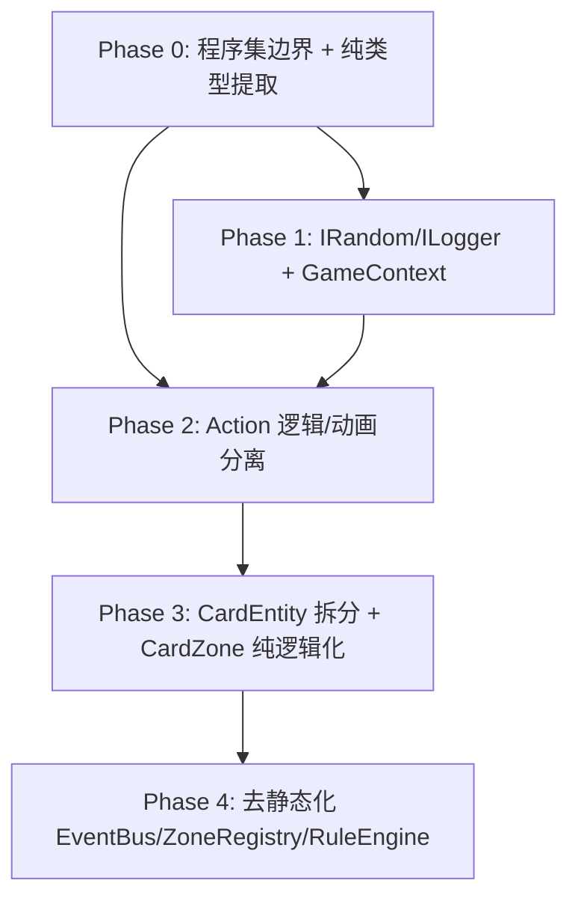

# Cards 架构重构详细计划

## 目标目录结构总览

```
Assets/Cards/
├── Cards.Unity.asmdef              ← Unity 层程序集（自动涵盖子目录中没有独立 asmdef 的文件）
├── Runtime/
│   ├── Cards.Runtime.asmdef        ← 纯 C# 逻辑程序集（零 UnityEngine 引用）
│   └── ...纯逻辑文件
├── Tests/
│   ├── Cards.Tests.asmdef          ← 测试程序集
│   └── EditMode/
├── Editor/
│   ├── Cards.Editor.asmdef         ← 编辑器程序集
│   └── ...
├── Core/, Actions/, FSM/, ...      ← Unity 依赖的文件留在原位
```

核心原则：`Runtime/` 文件夹中**不允许出现任何 `using UnityEngine`**，由 asmdef 的引用列表在编译层面强制保证。

---

## Phase 0：程序集边界 + 纯类型提取

**前置条件**: 无
**目标**: 建立物理隔离的编译边界，将已经是纯 C# 的类型移入 `Runtime/`
**预计改动**: 新建 4 个 asmdef + 8~10 个文件移动/提取

### 0.1 创建 Assembly Definition 文件

**新建文件**:

- `Assets/Cards/Runtime/Cards.Runtime.asmdef`
  - `autoReferenced: false`
  - `references: []`（不引用任何 Unity 模块）
  - `includePlatforms: []`（全平台）
  - `defineConstraints: []`
- `Assets/Cards/Cards.Unity.asmdef`
  - `references: ["Cards.Runtime"]`
  - `autoReferenced: true`
  - 放在 `Assets/Cards/` 根目录，自动覆盖 Core/, Actions/, Zones/, FSM/, Effects/, Rules/, Levels/, Decks/, Data/ 等子目录
- `Assets/Cards/Editor/Cards.Editor.asmdef`
  - `references: ["Cards.Unity", "Cards.Runtime"]`
  - `includePlatforms: ["Editor"]`
- `Assets/Cards/Tests/Cards.Tests.asmdef`
  - `references: ["Cards.Runtime", "UnityEngine.TestRunner", "UnityEditor.TestRunner"]`
  - `includePlatforms: ["Editor"]`
  - `defineConstraints: ["UNITY_INCLUDE_TESTS"]`
  - `optionalUnityReferences: ["TestAssemblies"]`

### 0.2 从现有文件中提取纯类型

以下类型当前被混合在包含 Unity 依赖的文件中，需要提取到独立文件并移入 `Runtime/`：

**从 [ZoneConfigData.cs](Assets/Cards/Levels/ZoneConfigData.cs) 中提取**:

- `ZoneId` 枚举 → `Assets/Cards/Runtime/Zones/ZoneId.cs`
- `LayoutType` 枚举保留在原文件（仅 Unity 层使用）

**从 [CardData.cs](Assets/Cards/Data/CardData.cs) 中提取**:

- `CardTag` 枚举 → `Assets/Cards/Runtime/Data/CardTag.cs`

### 0.3 移动已经是纯 C# 的文件到 Runtime/

逐个检查 `using`，移除无用的 `using UnityEngine`，然后移动：


| 原路径                                      | 新路径                                              | 需要的修改                                |
| ---------------------------------------- | ------------------------------------------------ | ------------------------------------ |
| `Core/ICombatable.cs`                    | `Runtime/Core/ICombatable.cs`                    | 无（已是纯 C#）                            |
| `Core/CardOwner.cs`                      | `Runtime/Core/CardOwner.cs`                      | `using Cards.Zones` 改为引用新的 ZoneId 位置 |
| `Zones/ZoneIdExtensions.cs`              | `Runtime/Zones/ZoneIdExtensions.cs`              | 命名空间不变                               |
| `FSM/IState.cs`                          | `Runtime/FSM/IState.cs`                          | 删除 `using UnityEngine`（未实际使用）        |
| `FSM/GameStateMachine.cs`                | `Runtime/FSM/GameStateMachine.cs`                | 删除 `using UnityEngine`（未实际使用）        |
| `Rules/Interactions/IInteractionRule.cs` | `Runtime/Rules/Interactions/IInteractionRule.cs` | 无                                    |
| `Actions/GameAction.cs`                  | `Runtime/Actions/GameAction.cs`                  | 删除 `using UnityEngine`（未实际使用）        |


### 0.4 修复编译

移动后，Unity 层的文件会通过 `Cards.Unity.asmdef` 引用 `Cards.Runtime` 来访问这些类型。**命名空间保持不变**（如 `Cards.Core`、`Cards.Zones`），确保现有代码只需要重新编译，无需改任何 `using` 语句。

### 0.5 验证清单（Phase 0 完成标准）

- Unity 编辑器无编译错误
- 运行游戏，行为与重构前完全一致
- `Cards.Runtime.asmdef` 的 `references` 列表为空（无 UnityEngine）
- 在 `Runtime/` 中的任何文件加一行 `using UnityEngine;` 并尝试使用会导致**编译失败**（证明隔离生效）
- `Assets/Cards/Tests/EditMode/` 下创建一个空的占位测试文件，确认 Test Runner 能识别

---

## Phase 1：平台抽象接口 + GameContext

**前置条件**: Phase 0 完成
**目标**: 用接口替换 `UnityEngine.Random`、`Debug.Log` 等平台调用；创建 GameContext 容器
**预计改动**: 新建 ~8 个文件，修改 ~6 个文件

### 1.1 在 Runtime/ 中创建服务接口

**新建文件**:

- `Runtime/Services/IRandom.cs`

```csharp
namespace Cards.Services
{
    public interface IRandom
    {
        int Range(int minInclusive, int maxExclusive);
    }
}
```

- `Runtime/Services/ILogger.cs`

```csharp
namespace Cards.Services
{
    public interface ILogger
    {
        void Log(string message);
        void LogWarning(string message);
        void LogError(string message);
    }
}
```

- `Runtime/Services/GameContext.cs`（Phase 1 版本，后续阶段扩展）

```csharp
namespace Cards.Services
{
    public class GameContext
    {
        public IRandom Random { get; }
        public ILogger Logger { get; }

        public GameContext(IRandom random, ILogger logger)
        {
            Random = random;
            Logger = logger;
        }
    }
}
```

### 1.2 在 Unity 层创建接口实现

**新建文件**:

- `Core/Services/UnityRandom.cs`（在 Cards.Unity 程序集中）

```csharp
using Cards.Services;
namespace Cards.Core.Services
{
    public class UnityRandom : IRandom
    {
        public int Range(int min, int max) => UnityEngine.Random.Range(min, max);
    }
}
```

- `Core/Services/UnityLogger.cs`

```csharp
using Cards.Services;
namespace Cards.Core.Services
{
    public class UnityLogger : ILogger
    {
        public void Log(string msg) => UnityEngine.Debug.Log(msg);
        public void LogWarning(string msg) => UnityEngine.Debug.LogWarning(msg);
        public void LogError(string msg) => UnityEngine.Debug.LogError(msg);
    }
}
```

### 1.3 重构逻辑层类，注入 IRandom / ILogger

**修改 [DiceRoller.cs](Assets/Cards/Core/DiceRoller.cs)** → 移入 `Runtime/Core/DiceRoller.cs`：

- 改为实例类，构造函数接收 `IRandom`
- `Roll()` 改为实例方法，内部调用 `_random.Range()` 代替 `UnityEngine.Random.Range()`

**修改 [CombatResolver.cs](Assets/Cards/Core/CombatResolver.cs)** → 移入 `Runtime/Core/CombatResolver.cs`：

- 改为实例类，构造函数接收 `IRandom` 和 `DiceRoller`
- `RollAttack()` / `RollDamage()` 改为实例方法
- 删除 `using UnityEngine`

**修改 [CardModel.cs](Assets/Cards/Core/CardModel.cs)** → 移入 `Runtime/Core/CardModel.cs`：

- 构造函数增加 `ILogger` 参数（可选，默认为 `NullLogger`）
- 所有 `Debug.Log` 替换为 `_logger.Log()`
- `CardData` 的引用改为纯数据接口 `ICardData`（见 1.4）

### 1.4 CardData 纯数据接口

**新建 `Runtime/Data/ICardData.cs`**:

```csharp
namespace Cards.Data
{
    public interface ICardData
    {
        string CardId { get; }
        string CardName { get; }
        int Cost { get; }
        int Health { get; }
        int ArmorClass { get; }
        int AttackBonus { get; }
        int Attack { get; }
        int DiceCount { get; }
        int DiceSides { get; }
        System.Collections.Generic.IReadOnlyList<CardTag> Tags { get; }
    }
}
```

**修改 [CardData.cs](Assets/Cards/Data/CardData.cs)**（保持在 Unity 层）:

- 实现 `ICardData` 接口
- 现有字段不变，添加接口属性的显式实现

**修改 CardModel**:

- 将 `public CardData Data` 改为 `public ICardData Data`

### 1.5 GameManager 初始化 GameContext

**修改 [GameManager.cs](Assets/Cards/Core/GameManager.cs)**:

- 在 `Awake()` 中创建 `GameContext`：

```csharp
var ctx = new GameContext(new UnityRandom(), new UnityLogger());
```

- 将 ctx 作为公共属性 `public GameContext Context { get; private set; }` 供 FSM States 等访问
- 向下传递给需要的组件（CombatResolver 的创建等）

### 1.6 编写第一批单元测试

**新建 `Tests/EditMode/DiceRollerTests.cs`**:

- 用一个固定序列的 `MockRandom` 测试 `DiceRoller.Roll()`
- 验证 2d6 的结果等于两次 Range 调用之和

**新建 `Tests/EditMode/CombatResolverTests.cs`**:

- 测试自然骰 20 → CriticalHit
- 测试自然骰 1 → CriticalMiss
- 测试 totalAttack >= AC → Hit
- 测试 totalAttack < AC → Miss
- 全部使用 `MockRandom`，结果 100% 可预测

**新建 `Tests/EditMode/Mocks/MockRandom.cs`**:

```csharp
public class MockRandom : IRandom
{
    private Queue<int> sequence;
    public MockRandom(params int[] values) { sequence = new Queue<int>(values); }
    public int Range(int min, int max) => sequence.Dequeue();
}
```

### 1.7 验证清单（Phase 1 完成标准）

- `Runtime/` 文件夹中仍然没有任何 `using UnityEngine`
- Unity Test Runner 中所有 EditMode 测试通过
- CombatResolver 的测试覆盖了 4 种攻击结果 
- 运行游戏，行为与重构前完全一致
- `DiceRoller` 和 `CombatResolver` 在 Runtime/ 中，不再是 static class

---

## Phase 2：Action 系统逻辑/动画分离

**前置条件**: Phase 1 完成
**目标**: 每个 GameAction 的逻辑可以脱离 Unity 协程独立执行；动画可一键禁用
**预计改动**: 新建 ~4 个文件，修改 ~6 个文件

### 2.1 定义动画策略接口

**新建 `Runtime/Services/IAnimationPolicy.cs`**:

```csharp
namespace Cards.Services
{
    public interface IAnimationPolicy
    {
        bool IsEnabled { get; }
        float TimeScale { get; }  // 1.0=正常, 0=跳过
    }
}
```

**新建 `Runtime/Services/IActionQueue.cs`**:

```csharp
namespace Cards.Services
{
    public interface IActionQueue
    {
        void Enqueue(GameAction action);
        bool IsProcessing { get; }
    }
}
```

### 2.2 重构 GameAction 基类

**修改 `Runtime/Actions/GameAction.cs`**（已在 Runtime/ 中）:

```csharp
public abstract class GameAction
{
    public bool IsCompleted { get; protected set; }

    // 纯逻辑：同步执行，修改游戏状态
    public abstract void Execute(GameContext ctx);

    // 动画表现：返回协程供 Unity 层播放（仅在动画启用时调用）
    public virtual IEnumerator AnimateRoutine() { yield break; }

    // 保留向后兼容：默认的 ExecuteRoutine 同时调用逻辑和动画
    public virtual IEnumerator ExecuteRoutine(GameContext ctx)
    {
        Execute(ctx);
        yield return AnimateRoutine();
        IsCompleted = true;
    }

    public virtual void Tick() { }
}
```

### 2.3 逐个重构现有 Action

**[DamageAction.cs](Assets/Cards/Actions/DamageAction.cs)** → 移入 `Runtime/Actions/`:

```csharp
public override void Execute(GameContext ctx)
{
    target.TakeDamage(damage);
    ctx.Logger.Log($"[Action] {sourceName} dealt {damage} to {target.CombatName}");
}

public override IEnumerator AnimateRoutine()
{
    yield return new WaitForSeconds(0.2f);  // 前摇
    yield return new WaitForSeconds(0.3f);  // 受击硬直
}
```

**[DrawCardAction.cs](Assets/Cards/Actions/DrawCardAction.cs)** → 移入 `Runtime/Actions/`:

- `Execute()`: 纯数据操作（从 drawPile 取牌、调用 RuleEngine、加入 handZone）
- `AnimateRoutine()`: `yield return new WaitForSeconds(0.35f)`
- 注意：当前直接访问 `ZoneRegistry`（static），暂时保留，Phase 4 去静态化时再改

**[ReshuffleAction.cs](Assets/Cards/Actions/ReshuffleAction.cs)** → 移入 `Runtime/Actions/`:

- `Execute()`: 取出弃牌堆所有牌 → ResetStats → 加入抽牌堆 → Shuffle
- `AnimateRoutine()`: 飞行动画循环 + 等待

### 2.4 修改 ActionManager 支持动画策略

**修改 [ActionManager.cs](Assets/Cards/Actions/ActionManager.cs)**（保留在 Unity 层）:

- 实现 `IActionQueue` 接口
- `ProcessQueue` 协程改为：

```csharp
private IEnumerator ProcessQueue()
{
    isExecuting = true;
    while (actionQueue.Count > 0)
    {
        GameAction action = actionQueue.Dequeue();
        
        if (animationPolicy.IsEnabled)
        {
            yield return StartCoroutine(action.ExecuteRoutine(ctx));
        }
        else
        {
            action.Execute(ctx);
            action.IsCompleted = true;  // 跳过动画直接完成
        }

        while (!action.IsCompleted) { action.Tick(); yield return null; }
    }
    isExecuting = false;
}
```

### 2.5 扩展 GameContext

**修改 `Runtime/Services/GameContext.cs`**:

- 增加 `IAnimationPolicy AnimationPolicy { get; }` 属性
- 增加 `IActionQueue Actions { get; }` 属性（Phase 2 先作为可选字段）

### 2.6 提供一键禁用入口

**新建 `Core/Services/AnimationPolicies.cs`**（Unity 层）:

```csharp
public class LiveAnimationPolicy : IAnimationPolicy
{
    public bool IsEnabled => true;
    public float TimeScale => 1.0f;
}

public class InstantAnimationPolicy : IAnimationPolicy
{
    public bool IsEnabled => false;
    public float TimeScale => 0f;
}
```

**修改 GameManager**:

- 添加 `[SerializeField] private bool disableAnimations = false;`
- 在 Inspector 中可勾选禁用动画
- 根据这个值选择 `LiveAnimationPolicy` 或 `InstantAnimationPolicy`

### 2.7 编写测试

**新建 `Tests/EditMode/ActionLogicTests.cs`**:

- 测试 `DamageAction.Execute()` 正确扣血
- 测试 `DrawCardAction.Execute()` 从牌堆顶部抽牌到手牌
- 测试 `ReshuffleAction.Execute()` 弃牌堆清空、牌堆重建
- 所有测试使用 `InstantAnimationPolicy`，无协程，纯同步

### 2.8 验证清单（Phase 2 完成标准）

- 在 GameManager Inspector 中勾选 `disableAnimations`，游戏逻辑正常运行但无动画等待
- 取消勾选后，动画行为恢复正常
- Action 的逻辑测试全部通过
- `DamageAction`、`DrawCardAction`、`ReshuffleAction` 已在 Runtime/ 中（纯 C#）
- `AnimateRoutine()` 中的 `WaitForSeconds` 不影响逻辑测试（因为测试时不调用它）

---

## Phase 3：CardEntity 数据/视图分离 + CardZone 纯逻辑化

**前置条件**: Phase 2 完成
**目标**: 卡牌的"逻辑身份"不再是 MonoBehaviour；CardZone 的数据操作可以脱离 Unity 测试
**预计改动**: 新建 ~3 个文件，修改 ~15 个文件（波及面最广的阶段）

### 3.1 创建 CardInstance（纯逻辑卡牌身份）

**新建 `Runtime/Core/CardInstance.cs`**:

```csharp
namespace Cards.Core
{
    public class CardInstance
    {
        public CardModel Model { get; }
        public ICardData Data => Model?.Data;
        public CardOwner Owner { get; }
        
        // 区域追踪（纯数据）
        public ZoneId? CurrentZoneId { get; set; }
        
        public CardInstance(ICardData data, CardOwner owner, ILogger logger = null)
        {
            Model = new CardModel(data, owner, logger);
            Owner = owner;
        }
    }
}
```

### 3.2 重构 CardZone 为纯逻辑

**修改 `Runtime/Zones/CardZone.cs`**（移入 Runtime/）:

- 泛型参数从 `CardEntity` 改为 `CardInstance`
- **移除** `Layout` 属性和所有 `Layout.Arrange()` 调用
- **增加**事件通知：

```csharp
public event Action<CardInstance, int> OnCardAdded;
public event Action<CardInstance> OnCardRemoved;
public event Action OnShuffled;

public void AddCard(CardInstance card)
{
    cards.Add(card);
    card.CurrentZoneId = this.ZoneId;
    OnCardAdded?.Invoke(card, cards.Count - 1);
}
```

- `Shuffle()` 使用 `IRandom` 代替 `UnityEngine.Random`（从 GameContext 获取）

### 3.3 创建 ZoneLayoutView（Unity 层视觉同步器）

**新建 `Zones/Layouts/ZoneLayoutView.cs`**（Unity 层）:

- 持有一个 `CardZone` 引用和一个 `IZoneLayout` 引用
- 监听 `CardZone.OnCardAdded` / `OnCardRemoved` / `OnShuffled` 事件
- 负责找到对应的 `CardEntityView` 并调用 `MoveTo()` 或重新排列
- 维护一个 `Dictionary<CardInstance, CardEntityView>` 映射

### 3.4 重构 CardEntity → CardEntityView

**修改 [CardEntity.cs](Assets/Cards/Core/CardEntity.cs)** → 重命名为 `CardEntityView`（保留在 Unity 层）:

- 持有 `CardInstance` 引用而非直接持有 `CardModel`
- `SetupCard()` 改为接收 `CardInstance`
- 视觉更新、`OnMouseDown`、`MoveTo` 协程保留
- 不再维护 `CurrentZone` / `CurrentZoneId`（由 `CardInstance` 管理）

### 3.5 重构 InteractionRequest

**修改 `Runtime/Rules/Interactions/InteractionRequest.cs`**（移入 Runtime/）:

- `SourceCard` 和 `TargetEntity` 类型从 `CardEntity` 改为 `CardInstance`
- `SourceZone` / `TargetZone` 已经是 `CardZone`（Phase 3.2 后为纯逻辑类型）

### 3.6 更新所有 Rule 和 Effect

以下文件中的 `CardEntity` 引用改为 `CardInstance`：

- [AttackRule.cs](Assets/Cards/Rules/Interactions/AttackRule.cs) → 移入 Runtime/
- [PlayEffectRule.cs](Assets/Cards/Rules/Interactions/PlayEffectRule.cs) → 移入 Runtime/
- [PlayEntityRule.cs](Assets/Cards/Rules/Interactions/PlayEntityRule.cs) → 移入 Runtime/
- [CardDispositionRule.cs](Assets/Cards/Rules/Interactions/CardDispositionRule.cs) → 移入 Runtime/
- [RuleEngine.cs](Assets/Cards/Rules/Interactions/RuleEngine.cs) → 移入 Runtime/
- [DamageEffect.cs](Assets/Cards/Effects/DamageEffect.cs) → 移入 Runtime/
- [AOEDamageEffect.cs](Assets/Cards/Effects/AOEDamageEffect.cs) → 移入 Runtime/
- [DrawCardEffect.cs](Assets/Cards/Effects/DrawCardEffect.cs) → 移入 Runtime/
- [ICardEffect.cs](Assets/Cards/Effects/ICardEffect.cs) → 移入 Runtime/

注意：DamageEffect 和 AOEDamageEffect 当前使用 `[Serializable]` + `[Header]` 等 Unity 属性。移入 Runtime 后需要移除这些 attribute，改为纯字段。序列化兼容性通过在 Unity 层保留一个 Wrapper 或使用 `[SerializeReference]` 的自定义 drawer 处理。

### 3.7 更新事件定义

**修改 `Runtime/Core/Events/EventBus.cs`** 中的事件类型（移入 Runtime/）:

- `CardClickedEvent`、`CardDiedEvent`、`RequestMoveCardEvent` 等中的 `CardEntity` 引用改为 `CardInstance`
- `RequestMoveCardEvent.UseAnimation` 移除（动画决策由 AnimationPolicy 统一控制）

### 3.8 更新 Handlers

[CardPlayHandler.cs](Assets/Cards/Rules/Handlers/CardPlayHandler.cs) 和 [CardDeathHandler.cs](Assets/Cards/Rules/Handlers/CardDeathHandler.cs) 保留在 Unity 层，但内部引用改为 `CardInstance`。

### 3.9 编写测试

**新建 `Tests/EditMode/CardZoneTests.cs`**:

- 测试 AddCard / RemoveCard / DrawTopCard / Shuffle / TakeAllCards
- 全部使用 `CardInstance`（纯逻辑），无需 GameObject
- 验证事件触发次数和顺序

**新建 `Tests/EditMode/RuleEngineTests.cs`**:

- 构造 InteractionRequest，手动挂载规则，验证 ProcessInteraction 的行为
- 测试 AttackRule 命中/未命中
- 测试 PlayEntityRule 将实体牌正确放入战场
- 测试 CardDispositionRule 将非实体牌送入弃牌堆

### 3.10 验证清单（Phase 3 完成标准）

- `CardZone` 在 Runtime/ 中，不依赖 `UnityEngine`
- `InteractionRequest`、所有 Rule、所有 Effect 在 Runtime/ 中
- CardZone 和 RuleEngine 的单元测试全部通过
- 游戏运行正常：`ZoneLayoutView` 正确响应 CardZone 事件并驱动视觉排列
- `CardEntityView` 仍能正确显示卡面、响应点击、播放移动动画

---

## Phase 4：去静态化——EventBus / ZoneRegistry / RuleEngine 实例化

**前置条件**: Phase 3 完成
**目标**: 所有静态服务变为实例，通过 GameContext 注入；可在纯 C# 环境中模拟完整游戏回合
**预计改动**: 新建 ~4 个接口文件，修改 ~12 个文件

### 4.1 创建服务接口

**新建 `Runtime/Services/IEventBus.cs`**:

```csharp
namespace Cards.Services
{
    public interface IEventBus
    {
        EventToken Subscribe<T>(Action<T> handler);
        void Unsubscribe(EventToken token);
        void Publish<T>(T gameEvent);
        void Clear();
    }
}
```

**新建 `Runtime/Services/IZoneRegistry.cs`**:

```csharp
namespace Cards.Services
{
    public interface IZoneRegistry
    {
        void Register(CardZone zone);
        CardZone Get(ZoneId id, int index = 0);
        IReadOnlyList<CardZone> GetAll(ZoneId id);
        void Clear();
    }
}
```

**新建 `Runtime/Services/IRuleEngine.cs`**:

```csharp
namespace Cards.Services
{
    public interface IRuleEngine
    {
        void ProcessInteraction(InteractionRequest request);
    }
}
```

### 4.2 将静态类改为实例类并实现接口

**修改 `Runtime/Core/Events/EventBus.cs`**:

- `public class EventBus : IEventBus`（去掉 `static`）
- `_subscribers` 变为实例字段

**修改 `Runtime/Zones/ZoneRegistry.cs`**:

- `public class ZoneRegistry : IZoneRegistry`（去掉 `static`）
- `zonesById` / `zonesByName` 变为实例字段

**修改 `Runtime/Rules/Interactions/RuleEngine.cs`**:

- `public class RuleEngine : IRuleEngine`（去掉 `static`）
- `ProcessInteraction` 变为实例方法
- 构造函数接收 `IZoneRegistry`（用于 DefaultMoveCard 中的 ZoneTransferService）

**修改 `Runtime/Zones/ZoneTransferService.cs`**（移入 Runtime/）:

- 去掉 `static`，变为实例类

### 4.3 完善 GameContext（最终版本）

```csharp
public class GameContext
{
    public IRandom Random { get; }
    public ILogger Logger { get; }
    public IAnimationPolicy AnimationPolicy { get; }
    public IActionQueue Actions { get; }
    public IEventBus Events { get; }
    public IZoneRegistry Zones { get; }
    public IRuleEngine Rules { get; }
    public CombatResolver Combat { get; }
    
    // 工厂方法
    public static GameContext CreateForTest(IRandom random = null, ...)
    {
        // 使用 Mock/默认实现创建完整的测试上下文
    }
}
```

### 4.4 更新所有消费者

需要修改的文件（将 `XxxClass.StaticMethod()` 改为 `ctx.Xxx.Method()`）：

- `Runtime/Actions/DrawCardAction.cs` — `ZoneRegistry.Get()` → `ctx.Zones.Get()`，`ActionManager.Instance.AddAction()` → `ctx.Actions.Enqueue()`，`RuleEngine.ProcessInteraction()` → `ctx.Rules.ProcessInteraction()`
- `Runtime/Actions/ReshuffleAction.cs` — 类似
- `Runtime/Rules/Interactions/AttackRule.cs` — `CombatResolver.Xxx()` → `ctx.Combat.Xxx()`，`ActionManager.Instance.AddAction()` → `ctx.Actions.Enqueue()`
- `Runtime/Rules/Interactions/PlayEffectRule.cs` — `ActionManager.Instance.AddAction()` → `ctx.Actions.Enqueue()`
- `Runtime/Rules/Interactions/CardDispositionRule.cs` — `EventBus.Publish()` → `ctx.Events.Publish()`
- `Runtime/Effects/DamageEffect.cs` — `CombatResolver` 调用
- `Runtime/Effects/AOEDamageEffect.cs` — `ZoneRegistry.Get()` → `ctx.Zones.Get()`
- `Runtime/Effects/DrawCardEffect.cs` — 无直接静态调用，但生成的 DrawCardAction 需要 ctx
- Unity 层：`CardPlayHandler.cs`、`CardDeathHandler.cs`、`GameManager.cs`、所有 FSM States

### 4.5 FSM States 去除 Unity 输入依赖

**修改 FSM States**（仍在 Unity 层）:

- 将 `Input.GetKeyDown()` 调用提取到 `IInputProvider` 接口
- 将 `Time.deltaTime` 提取到 `ITimeProvider` 接口
- 或更简单地：让 FSM States 保持在 Unity 层，但让它们通过 `GameContext` 获取服务

### 4.6 编写集成测试

**新建 `Tests/EditMode/GameFlowTests.cs`**:

```csharp
[Test]
public void FullTurn_DrawAndPlayCard_DamageApplied()
{
    // 1. 用 GameContext.CreateForTest() 创建纯测试环境
    // 2. 创建 2 个 CardZone（手牌、战场），注册到 ZoneRegistry
    // 3. 创建 CardInstance，放入手牌
    // 4. 构造 InteractionRequest，调用 RuleEngine
    // 5. 断言目标扣血、牌进入弃牌堆
    // 全程无 Unity 依赖，纯 C# 同步执行
}
```

### 4.7 清理静态残留

- EventBus 原来的 static 方法可暂时保留为 `[Obsolete]` 的转发方法，方便渐进迁移
- 在 Runtime/ 程序集中搜索所有剩余的 `static`，确认只剩工具方法（如 `CombatResolver.IsHit()`）

### 4.8 验证清单（Phase 4 完成标准）

- `Runtime/` 程序集中没有任何 `static class`（枚举扩展方法除外）
- `Runtime/` 程序集中没有任何 `Singleton` 或 `.Instance` 调用
- GameFlowTests 可在纯 EditMode 下通过，模拟完整的抽牌-出牌-伤害-死亡流程
- 游戏运行行为与重构前完全一致
- `GameContext.CreateForTest()` 可以在 3 行代码内创建一个完整的可测试环境

---

## 各阶段依赖关系图




注意：**Phase 1 和 Phase 2 的"代码改动"不重叠**（Phase 1 改 DiceRoller/CombatResolver/CardModel，Phase 2 改 GameAction/ActionManager/各Action子类），可以由两个人**基于 Phase 0 的成果同时开始**，但 Phase 2 的 ActionManager 改造依赖 Phase 1 中的 GameContext 定义，因此需要先协商 GameContext 接口，或让 Phase 1 先完成接口定义部分。

## 单阶段交付模板

每个阶段交付时应包含：

1. **变更清单**：列出所有新建、移动、修改的文件
2. **编译验证**：Unity 编辑器零编译错误截图
3. **功能验证**：游戏运行录屏（10秒，展示抽牌-出牌-洗牌流程）
4. **测试报告**：Test Runner 截图，所有测试绿色
5. **隔离验证**（Phase 0 起）：在 Runtime/ 中添加 `using UnityEngine` 会编译失败的截图

---

## Phase 1 交付记录

### 1. 变更清单

#### 新建文件（Runtime/ — 纯 C# 逻辑层）

| 文件 | 说明 |
|---|---|
| `Runtime/Services/IRandom.cs` | 随机数抽象接口 |
| `Runtime/Services/ILogger.cs` | 日志抽象接口 |
| `Runtime/Services/NullLogger.cs` | 空日志实现（默认值，避免空检查） |
| `Runtime/Services/GameContext.cs` | Phase 1 版服务容器，持有 IRandom、ILogger、DiceRoller、CombatResolver |
| `Runtime/Data/ICardData.cs` | 卡牌纯数据接口（脱离 ScriptableObject） |
| `Runtime/Core/DiceRoller.cs` | 重构：static → 实例类，构造注入 IRandom |
| `Runtime/Core/CombatResolver.cs` | 重构：static class → 实例类，构造注入 IRandom + DiceRoller；IsHit() 保留 static（纯函数） |
| `Runtime/Core/CardModel.cs` | 重构：注入 ILogger 替代 Debug.Log；Data 类型改为 ICardData |

#### 新建文件（Unity 层）

| 文件 | 说明 |
|---|---|
| `Core/Services/UnityRandom.cs` | IRandom 的 Unity 实现，委托 UnityEngine.Random.Range |
| `Core/Services/UnityLogger.cs` | ILogger 的 Unity 实现，委托 UnityEngine.Debug.Log/LogWarning/LogError |

#### 新建文件（测试层）

| 文件 | 说明 |
|---|---|
| `Tests/EditMode/Mocks/MockRandom.cs` | 队列式确定性 IRandom mock，用于可预测的单元测试 |
| `Tests/EditMode/DiceRollerTests.cs` | 4 个测试：2d6 求和、1d20、0 骰、3d8 |
| `Tests/EditMode/CombatResolverTests.cs` | 10 个测试：自然 20 暴击、自然 1 大失败、命中/未命中、IsHit 正负、伤害骰、暴击翻倍、无骰基础伤害、无骰暴击翻倍 |

#### 修改文件

| 文件 | 变更内容 |
|---|---|
| `Data/CardData.cs` | 实现 `ICardData` 接口（显式属性桥接字段→属性） |
| `Core/GameManager.cs` | Awake 中创建 `GameContext(UnityRandom, UnityLogger)`，暴露 `Context` 属性 |
| `Core/CardEntity.cs` | 保留私有 `_cardData` 字段用于视觉层；SetupCard 向 CardModel 传递 ILogger |
| `Rules/Interactions/AttackRule.cs` | `CombatResolver.RollAttack/RollDamage` → `GameManager.Instance.Context.Combat.xxx`（过渡方案，Phase 4 替换为 ctx 注入） |
| `Effects/DamageEffect.cs` | 同上，静态调用改为实例调用 |

#### 删除文件（已移入 Runtime/）

| 原路径 | 新路径 |
|---|---|
| `Core/DiceRoller.cs` (+.meta) | `Runtime/Core/DiceRoller.cs` |
| `Core/CombatResolver.cs` (+.meta) | `Runtime/Core/CombatResolver.cs` |
| `Core/CardModel.cs` (+.meta) | `Runtime/Core/CardModel.cs` |

### 2. 编译验证

- Linter 检查：Runtime/、Core/、Data/、Effects/、Rules/、Tests/ 全部零错误
- `Runtime/` 目录中 `grep "using UnityEngine"` 结果为空，隔离有效

### 3. 隔离验证

- `Cards.Runtime.asmdef` 的 `noEngineReferences: true` 确保编译层面禁止引用 UnityEngine
- Runtime/ 中 16 个 .cs 文件均无 `using UnityEngine`

### 4. 测试清单

| 测试类 | 测试数量 | 覆盖范围 |
|---|---|---|
| `DiceRollerTests` | 4 | Roll 方法的各种骰子组合 |
| `CombatResolverTests` | 10 | 攻击检定 4 种结果 + IsHit 判定 + 伤害计算 4 种场景 |
| `RuntimeAssemblyTests` | 3 | Phase 0 遗留的枚举/状态机烟雾测试 |

### 5. 验证清单对照（Phase 1 完成标准）

- [x] `Runtime/` 文件夹中没有任何 `using UnityEngine`
- [x] CombatResolver 的测试覆盖了 4 种攻击结果（CriticalHit / CriticalMiss / Hit / Miss）
- [x] `DiceRoller` 和 `CombatResolver` 在 Runtime/ 中，不再是 static class
- [x] CardModel 在 Runtime/ 中，使用 ICardData + ILogger
- [x] GameContext 在 Awake 中正确初始化
- [ ] Unity 编辑器无编译错误 — **需在 Unity 中验证**
- [ ] 运行游戏，行为与重构前完全一致 — **需在 Unity 中验证**
- [ ] Unity Test Runner 中所有 EditMode 测试通过 — **需在 Unity 中验证**

### 6. 过渡方案说明

AttackRule 和 DamageEffect 通过 `GameManager.Instance.Context.Combat` 临时获取 CombatResolver 实例。此耦合将在 Phase 4（去静态化）中替换为通过 GameContext 参数直接注入。

---

## Phase 2 交付记录

### 1. 变更清单

#### 新建文件（Runtime/ — 纯 C# 逻辑层）

| 文件 | 说明 |
|---|---|
| `Runtime/Services/IAnimationPolicy.cs` | 动画策略抽象接口，统一控制动作系统是否播放动画以及时间缩放 |
| `Runtime/Services/IActionQueue.cs` | Action 队列抽象接口，供 Runtime 逻辑同步入队下一步动作 |

#### 新建文件（Unity 层）

| 文件 | 说明 |
|---|---|
| `Core/Services/AnimationPolicies.cs` | `LiveAnimationPolicy` / `InstantAnimationPolicy` 两个默认实现，分别对应正常播放与瞬时执行 |

#### 新建文件（测试层）

| 文件 | 说明 |
|---|---|
| `Tests/EditMode/ActionLogicTests.cs` | 4 个测试：Damage 同步扣血、DrawCard 正常抽牌、空牌库时入队 Reshuffle+Retry、Reshuffle 重建牌库并重置属性 |

#### 修改文件

| 文件 | 变更内容 |
|---|---|
| `Runtime/Actions/GameAction.cs` | 拆分为 `Execute(GameContext)` + `AnimateRoutine()`，保留 `ExecuteRoutine(GameContext)` 兼容入口，并增加 `MarkCompleted()` |
| `Runtime/Services/GameContext.cs` | 新增 `AnimationPolicy`、`Actions` 两个依赖注入入口，继续作为 Runtime 统一上下文 |
| `Actions/ActionManager.cs` | 实现 `IActionQueue`，根据 `AnimationPolicy.IsEnabled` 在“同步逻辑执行”与“逻辑+动画协程”之间切换 `|
| `Core/GameManager.cs` | 新增 Inspector 开关 `disableAnimations`，创建 `ActionManager` 后注入 `GameContext` 与动画策略 |
| `Actions/DamageAction.cs` | 拆分逻辑执行与动画等待；伤害扣除进入 `Execute()`，受击等待进入 `AnimateRoutine()` |
| `Actions/DrawCardAction.cs` | 抽牌、空牌库补洗、重试入队改为同步逻辑；抽牌停顿进入 `AnimateRoutine()`；通过 `ctx.Actions` 入队后续动作 |
| `Actions/ReshuffleAction.cs` | 洗回牌库、重置模型状态、Shuffle 改为同步逻辑；逐张回收与停顿改为动画阶段 |
| `Rules/Interactions/InteractionRequest.cs` | 新增 `UseAnimation` 字段，用于规则链与默认移动逻辑透传动画决策 |
| `Rules/Interactions/RuleEngine.cs` | 默认移动逻辑改为尊重 `request.UseAnimation` |
| `Rules/Interactions/PlayEntityRule.cs` | 实体进场移动改为尊重 `request.UseAnimation` |
| `Rules/Interactions/CardDispositionRule.cs` | 非实体牌去向事件改为透传 `request.UseAnimation` |
| `Tests/Cards.Tests.asmdef` | 增加对 `Cards.Unity` 的引用，使当前 Unity 层 Action 测试可被测试程序集访问 |

### 2. 编译验证

- Linter 检查：`Runtime/Actions`、`Runtime/Services`、`Actions/`、`Core/`、`Rules/`、`Tests/` 本次改动文件全部零错误
- `GameAction` / `ActionManager` / `GameManager` / 三个 Action 子类之间的调用关系已改为以 `GameContext` 为中心，不再强依赖“动作内部自行跑完整协程”

### 3. 功能验证

- 代码层面已支持在 `GameManager` Inspector 中通过 `disableAnimations` 一键切换动作系统是否播放动画
- 当动画禁用时，`ActionManager` 会仅调用 `Execute()`，动作逻辑同步完成，不再等待 `WaitForSeconds`
- 当动画启用时，仍通过 `ExecuteRoutine(GameContext)` 串联逻辑与表现，保留现有协程驱动行为
- [ ] Unity 编辑器内勾选/取消勾选 `disableAnimations` 后的抽牌-洗牌-出牌流程录屏 — **需在 Unity 中验证**

### 4. 测试清单

| 测试类 | 测试数量 | 覆盖范围 |
|---|---|---|
| `ActionLogicTests` | 4 | DamageAction 逻辑扣血、DrawCardAction 抽牌与空牌库补洗入队、ReshuffleAction 牌库重建与属性重置 |
| `DiceRollerTests` | 4 | Phase 1 保留：骰子求和逻辑 |
| `CombatResolverTests` | 10 | Phase 1 保留：攻击判定与伤害计算 |
| `RuntimeAssemblyTests` | 3 | Phase 0/1 保留：程序集烟雾测试 |

### 5. 验证清单对照（Phase 2 完成标准）

- [x] `GameAction` 已拆分为 `Execute()` + `AnimateRoutine()`
- [x] `IAnimationPolicy`、`IActionQueue` 已创建并接入 `GameContext`
- [x] `ActionManager` 已支持一键禁用动画时仅执行同步逻辑
- [x] `GameManager` 已提供 `disableAnimations` 开关与默认策略实现
- [x] `DamageAction`、`DrawCardAction`、`ReshuffleAction` 已完成逻辑/动画分离
- [x] 已新增 Action 逻辑测试，测试路径不依赖协程等待
- [ ] 在 GameManager Inspector 中勾选 `disableAnimations`，游戏逻辑正常运行但无动画等待 — **需在 Unity 中验证**
- [ ] 取消勾选后，动画行为恢复正常 — **需在 Unity 中验证**
- [ ] Unity Test Runner 中所有 EditMode 测试通过 — **需在 Unity 中验证**
- [ ] `DamageAction`、`DrawCardAction`、`ReshuffleAction` 已在 Runtime/ 中（纯 C#） — **受 `CardZone` / `CardEntity` 仍位于 Unity 层限制，待 Phase 3 完成数据/视图分离后再整体下沉**

### 6. 过渡方案说明

当前 `DrawCardAction` 和 `ReshuffleAction` 仍依赖 `CardZone`、`CardEntity`、`ZoneRegistry` 等 Unity 层对象，因此本阶段先完成“动作逻辑/动画分离 + 动画策略注入 + 同步逻辑测试”三项核心目标，暂不强行迁入 `Runtime/`，以避免提前混入 Phase 3 的 CardInstance / CardZone 纯逻辑化改造。

另外，`RuleEngine`、`ZoneRegistry`、`ActionManager.Instance` 等静态访问本阶段继续保留，待 Phase 4 去静态化时统一替换为 `GameContext` 注入。

## Phase 3 交付记录

### 1. 变更清单

#### 新建文件（Runtime/ — 纯 C# 逻辑层）

| 文件 | 说明 |
|---|---|
| `Runtime/Core/CardInstance.cs` | 新增纯逻辑卡牌身份，承载 `CardModel`、所属玩家与当前区域状态 |
| `Runtime/Zones/CardZone.cs` | 区域容器改为纯逻辑类型，卡牌集合从 `CardEntity` 改为 `CardInstance`，并提供 Add/Remove/Draw/Shuffle 事件 |
| `Runtime/Zones/ZoneRegistry.cs` | 区域注册表迁入 Runtime，统一注册/查找纯逻辑 `CardZone` |
| `Runtime/Zones/ZoneTransferService.cs` | 区域转移逻辑迁入 Runtime，负责卡牌在不同 `CardZone` 间移动 |
| `Runtime/Core/Events/EventBus.cs` | 事件总线迁入 Runtime，事件载荷改为 `CardInstance` |
| `Runtime/Rules/Interactions/IInteractionRule.cs` | 规则接口迁入 Runtime，解除对 Unity 层卡牌对象的依赖 |
| `Runtime/Rules/Interactions/InteractionRequest.cs` | 交互请求改为使用 `CardInstance`、纯逻辑 `CardZone` 与 `GameContext` |
| `Runtime/Rules/Interactions/RuleEngine.cs` | 规则引擎迁入 Runtime，默认移动与事件转发逻辑全部改用纯逻辑对象 |
| `Runtime/Rules/Interactions/AttackRule.cs` | 攻击规则改为基于 `CardInstance` + `GameContext.Combat` 运作 |
| `Runtime/Rules/Interactions/PlayEffectRule.cs` | 效果执行规则迁入 Runtime，直接消费 `ICardEffect` 列表 |
| `Runtime/Rules/Interactions/PlayEntityRule.cs` | 实体牌进场规则迁入 Runtime |
| `Runtime/Rules/Interactions/CardDispositionRule.cs` | 非实体牌去向判定规则迁入 Runtime |
| `Runtime/Effects/ICardEffect.cs` | 效果接口迁入 Runtime，供 `ICardData` 和规则链共享 |
| `Runtime/Actions/DamageAction.cs` | 伤害动作迁入 Runtime，彻底脱离 Unity 层卡牌实体 |

#### 新建文件（Unity 层）

| 文件 | 说明 |
|---|---|
| `Zones/Layouts/ZoneLayoutView.cs` | 视觉同步器，监听 `CardZone` 事件并驱动 `IZoneLayout` 对应的卡牌视图布局 |

#### 新建文件（测试层）

| 文件 | 说明 |
|---|---|
| `Tests/EditMode/CardZoneTests.cs` | 2 个测试：覆盖 Add/Remove/DrawTopCard/TakeAllCards/Shuffle 与区域事件 |
| `Tests/EditMode/RuleEngineTests.cs` | 3 个测试：覆盖 AttackRule、PlayEntityRule、CardDispositionRule 的规则链行为 |

#### 修改文件

| 文件 | 变更内容 |
|---|---|
| `Core/CardEntity.cs` → `Core/CardEntityView.cs` | 将 Unity 侧卡牌对象明确为 View，持有 `CardInstance`，保留卡面显示、点击与移动动画 |
| `Core/GameManager.cs` | 初始建牌流程改为创建 `CardInstance + CardEntityView`，并通过 `ZoneTransferService` 处理移动事件 |
| `Levels/LevelZoneSetup.cs` | 创建纯逻辑 `CardZone`，为带布局的区域挂接 `ZoneLayoutView`，并维护卡牌视图注册 |
| `Zones/Layouts/IZoneLayout.cs` | 布局接口入参改为 `CardEntityView` 列表 |
| `Zones/Layouts/LineLayout.cs` | 线性布局适配 `CardEntityView` |
| `Zones/Layouts/PileLayout.cs` | 牌堆布局适配 `CardEntityView` |
| `Rules/Handlers/CardPlayHandler.cs` | 出牌处理链全面改用 `CardInstance` 和新的 `InteractionRequest` |
| `Rules/Handlers/CardDeathHandler.cs` | 死亡后处理改用纯逻辑区域转移 |
| `Actions/DrawCardAction.cs` | 抽牌逻辑改为对 `CardInstance` / `CardZone` 运作，并通过 Runtime RuleEngine 执行入手牌逻辑 |
| `Actions/ReshuffleAction.cs` | 洗牌逻辑改为对纯逻辑牌库/弃牌堆运作 |
| `Effects/DamageEffect.cs` | 改为基于 `CardInstance` / `GameContext.Combat` 取源与目标 |
| `Effects/AOEDamageEffect.cs` | 改为遍历纯逻辑 `CardZone.Cards` 并生成 Runtime `DamageAction` |
| `Data/CardData.cs` | 通过显式接口实现桥接 `ICardData.PlayEffects` |
| `Runtime/Data/ICardData.cs` | 新增 `PlayEffects` 只读接口 |
| `Tests/EditMode/ActionLogicTests.cs` | 既有动作测试由 `CardEntity` 迁移为 `CardInstance`，避免 GameObject 依赖 |

### 2. 编译验证

- `msbuild MyCardEx.sln /t:Build /p:Configuration=Debug` 已于 2026-04-01 本地通过
- 当前解决方案编译结果：`0 warning / 0 error`
- 运行时与 Unity 层引用方向已恢复为 `Cards.Unity -> Cards.Runtime` 单向依赖，`CardZone` / Rule / Event 类型不再反向依赖 MonoBehaviour

### 3. 功能验证

- `CardEntity` 已完成“数据/视图”拆分：逻辑身份为 `CardInstance`，Unity 表现为 `CardEntityView`
- `CardZone` 已变为纯逻辑容器，所有增删抽洗都可在无 GameObject 环境下测试
- `ZoneLayoutView` 已接入 `LevelZoneSetup`，通过监听 `CardZone.OnCardAdded` / `OnCardRemoved` / `OnShuffled` 驱动布局刷新
- `GameManager` 初始化牌库时会同步创建 `CardInstance` 与 `CardEntityView`，并向全部 `ZoneLayoutView` 注册映射
- 尝试通过 Tuanjie BatchMode 运行 EditMode 测试；编辑器可正常拉起、导入并退出，但当前环境未产出 `testResults.xml`，因此不能据此确认所有测试已在 Test Runner 中实际执行完成

### 4. 测试清单

| 测试类 | 测试数量 | 覆盖范围 |
|---|---|---|
| `CardZoneTests` | 2 | 纯逻辑 CardZone 的增删抽洗与事件触发 |
| `RuleEngineTests` | 3 | AttackRule、PlayEntityRule、CardDispositionRule 的 Runtime 规则链行为 |
| `ActionLogicTests` | 4 | Phase 2 保留：动作逻辑同步执行、抽牌补洗与重试入队 |
| `DiceRollerTests` | 4 | Phase 1 保留：骰子求和逻辑 |
| `CombatResolverTests` | 10 | Phase 1 保留：攻击判定与伤害计算 |
| `RuntimeAssemblyTests` | 3 | Phase 0/1 保留：程序集烟雾测试 |

### 5. 验证清单对照（Phase 3 完成标准）

- [x] `CardZone` 已在 Runtime/ 中，不依赖 `UnityEngine`
- [x] `InteractionRequest`、所有 Rule 已在 Runtime/ 中
- [x] `CardZoneTests`、`RuleEngineTests` 已补齐，且解决方案级编译通过
- [x] `ZoneLayoutView` 已创建并接入区域初始化流程
- [x] `CardEntityView` 仍保留卡面显示、点击事件发布与移动动画能力
- [ ] `DamageEffect`、`AOEDamageEffect`、`DrawCardEffect` 仍保留在 Unity 层作为可序列化效果定义；当前仅 `ICardEffect` 接口与规则执行链已迁入 Runtime
- [ ] Unity Test Runner 中所有 EditMode 测试通过 — **批处理环境未生成结果 XML，需在编辑器内确认**
- [ ] 游戏运行态下 `ZoneLayoutView` 驱动布局、卡面显示、点击响应与移动动画完全正常 — **需在 Unity PlayMode 中验证**

### 6. 过渡方案说明

本阶段已经完成最核心的数据/视图拆分：`CardEntity` 不再承担逻辑身份，`CardZone`、`RuleEngine`、`InteractionRequest`、`EventBus` 均已站到 Runtime 侧，后续 Phase 4 可以直接围绕“去 static 化”和“Context 注入”继续推进。

仍保留在 Unity 层的部分主要有两类：

- 具体 Effect 定义：`DamageEffect`、`AOEDamageEffect`、`DrawCardEffect` 目前仍承担 Inspector / `[SerializeReference]` 下的可序列化配置职责；若继续下沉，需要额外引入 Runtime 纯逻辑 effect 实现 + Unity 序列化 wrapper 的双层结构
- 带动画等待语义的动作：`DrawCardAction`、`ReshuffleAction` 逻辑已转为纯 `CardInstance` / `CardZone` 运作，但动画阶段仍依赖 Unity 协程等待；若要进一步下沉到 Runtime，需要先为“延时/动画 token”建立非 `WaitForSeconds` 的抽象

## Phase 4 交付记录

### 1. 变更清单

#### 新建文件（Runtime/ — 服务接口与上下文）

| 文件 | 说明 |
|---|---|
| `Runtime/Services/IEventBus.cs` | 事件总线接口，替代静态 `EventBus` 入口 |
| `Runtime/Services/IZoneRegistry.cs` | 区域注册服务接口，替代静态 `ZoneRegistry` |
| `Runtime/Services/IRuleEngine.cs` | 规则引擎接口，供 `GameContext` 与调用方通过实例访问规则处理 |
| `Runtime/Services/IInputProvider.cs` | 输入抽象，供 FSM 通过 `GameContext` 获取输入状态 |
| `Runtime/Services/ITimeProvider.cs` | 时间抽象，供 FSM 通过 `GameContext` 获取 `DeltaTime` |

#### 新建文件（Unity 层）

| 文件 | 说明 |
|---|---|
| `Core/Services/UnityInputProvider.cs` | `IInputProvider` 的 Unity 实现，封装测试键位输入 |
| `Core/Services/UnityTimeProvider.cs` | `ITimeProvider` 的 Unity 实现，封装 `Time.deltaTime` |

#### 新建文件（测试层）

| 文件 | 说明 |
|---|---|
| `Tests/EditMode/GameFlowTests.cs` | 新增完整流程测试，覆盖“抽牌 → 出牌 → 伤害 → 死亡/去向”链路 |

#### 修改文件

| 文件 | 变更内容 |
|---|---|
| `Runtime/Core/Events/EventBus.cs` | 去掉 `static`，改为实例服务并实现 `IEventBus` |
| `Runtime/Zones/ZoneRegistry.cs` | 去掉 `static`，改为实例服务并实现 `IZoneRegistry` |
| `Runtime/Zones/ZoneTransferService.cs` | 去掉 `static`，改为实例服务 |
| `Runtime/Rules/Interactions/RuleEngine.cs` | 去掉 `static`，改为实例服务并通过构造函数接收 `ZoneTransferService` |
| `Runtime/Services/GameContext.cs` | 扩展为最终版上下文：承载 `Events`、`Zones`、`Rules`、`ZoneTransfers`、`Input`、`Time`，并新增 `CreateForTest()` |
| `Runtime/Services/NullLogger.cs` | 去掉 `Instance` 静态入口，避免 Runtime 内部继续依赖 singleton 风格调用 |
| `Runtime/Core/CardModel.cs` | 默认 logger 改为直接构造 `NullLogger`，移除对 `NullLogger.Instance` 的依赖 |
| `Runtime/Actions/DamageAction.cs` | 在同步伤害结算后直接通过 `ctx.Events` 发布 `CardDiedEvent`，补齐纯 Runtime 死亡事件链 |
| `Runtime/Rules/Interactions/CardDispositionRule.cs` | 改为通过 `ctx.Events.Publish()` 发布去向事件 |
| `Runtime/Rules/Interactions/PlayEntityRule.cs` | 改为通过 `ctx.ZoneTransfers` 执行实体进场移动 |
| `Actions/DrawCardAction.cs` | 改为使用 `ctx.Zones`、`ctx.Rules`、`ctx.Actions`，彻底去掉 `ZoneRegistry` / `RuleEngine` / `ActionManager.Instance` 静态访问 |
| `Actions/ActionManager.cs` | 去掉对 `GameManager.Instance?.Context` 的回退依赖，要求显式注入 `GameContext` |
| `Effects/AOEDamageEffect.cs` | 改为通过 `request.Context.Zones` 查找目标区域 |
| `Core/CardEntityView.cs` | 改为持有 `GameContext`，点击事件通过 `context.Events` 发布，不再依赖静态 `EventBus` |
| `Zones/Layouts/ZoneLayoutView.cs` | 改为持有 `GameContext`，动画判定不再依赖 `GameManager.Instance` |
| `Levels/LevelZoneSetup.cs` | 初始化区域时接收 `GameContext`，并把它传给 `ZoneLayoutView` |
| `Rules/Handlers/CardPlayHandler.cs` | 从静态工具改为实例 handler，通过构造注入 `GameContext + GameStateMachine` |
| `Rules/Handlers/CardDeathHandler.cs` | 从静态工具改为实例 handler，通过构造注入 `GameContext` |
| `Core/GameManager.cs` | 负责组装完整 `GameContext`，订阅实例事件总线，注册实例 handler，并通过 `Context.Zones` / `Context.ZoneTransfers` 运作 |
| `FSM/States/GameState.cs` | 新增 `Context` / `IsActionQueueBusy` 便捷入口，供状态统一访问服务 |
| `FSM/States/GameSetupState.cs` | 改为通过 `Context.Actions` 入队初始抽牌动作 |
| `FSM/States/PlayerTurnStartState.cs` | 改为通过 `Context.Actions` 入队回合抽牌动作 |
| `FSM/States/PlayerMainPhaseState.cs` | 输入与动作队列判定改为通过 `Context.Input` / `Context.Actions` 访问 |
| `FSM/States/PlayerTurnEndState.cs` | 改为通过 `Context.Actions.IsProcessing` 判断结算完成 |
| `FSM/States/EnemyTurnState.cs` | 改为通过 `Context.Time.DeltaTime` 递减敌方回合延时 |
| `Tests/EditMode/ActionLogicTests.cs` | 测试上下文改为 `GameContext.CreateForTest()`，区域注册改为实例 `ctx.Zones` |
| `Tests/EditMode/RuleEngineTests.cs` | 测试上下文改为 `GameContext.CreateForTest()`，事件与规则调用改为实例服务 |
| `Tests/EditMode/CardZoneTests.cs` | 移除对 `NullLogger.Instance` 的依赖 |

### 2. 编译验证

- `msbuild MyCardEx.sln /t:Restore,Build /p:Configuration=Debug` 已于 2026-04-01 本地通过
- 当前解决方案编译结果：`7 warning / 0 error`
- 警告均为 Unity Inspector 序列化字段的 `CS0649` 静态分析噪音，不影响运行时行为
- 通过代码搜索确认：`Assets/Cards/Runtime/` 中不再存在 `EventBus.`、`ZoneRegistry.`、`RuleEngine.`、`NullLogger.Instance` 等静态访问残留

### 3. 功能验证

- `GameContext` 已从“半容器”升级为完整服务容器，Runtime/Unity 两侧共享统一依赖入口
- `EventBus`、`ZoneRegistry`、`RuleEngine`、`ZoneTransferService` 已全部完成实例化
- `CardPlayHandler`、`CardDeathHandler`、FSM states 已切到注入式依赖，不再绕过 `GameContext` 直接访问静态服务
- `DamageAction` 已能在纯 Runtime 场景下发布死亡事件，使“伤害 → 死亡处理”链条脱离 `CardEntityView`
- 尝试通过 Tuanjie BatchMode 运行 EditMode 测试；当前环境会报“工程已被另一个 Tuanjie 实例占用”，但系统进程列表中未看到明确的主编辑器进程，因此实际 Test Runner 结果仍需在本机编辑器内确认

### 4. 测试清单

| 测试类 | 测试数量 | 覆盖范围 |
|---|---|---|
| `GameFlowTests` | 1 | 纯服务上下文下的抽牌、出牌、伤害、死亡、去向整链路 |
| `ActionLogicTests` | 4 | 动作逻辑与抽牌补洗链路，全部通过实例 `GameContext` 注册区域 |
| `RuleEngineTests` | 3 | 规则链与事件发布，全部通过实例 `GameContext` 调用 |
| `CardZoneTests` | 2 | 纯逻辑区域行为 |
| `DiceRollerTests` | 4 | Phase 1 保留：骰子求和逻辑 |
| `CombatResolverTests` | 10 | Phase 1 保留：攻击判定与伤害计算 |
| `RuntimeAssemblyTests` | 3 | Phase 0/1 保留：程序集烟雾测试 |

### 5. 验证清单对照（Phase 4 完成标准）

- [x] `Runtime/` 程序集中不再保留核心静态服务；搜索结果仅剩扩展方法类 `CardOwnerExtensions` / `ZoneIdExtensions`
- [x] `Runtime/` 程序集中不再存在 `.Instance` 或 singleton 风格依赖
- [x] `GameContext.CreateForTest()` 已可在一行内创建带默认服务的完整测试上下文
- [x] 已新增 `GameFlowTests`，能够在纯服务上下文中模拟完整的抽牌-出牌-伤害-死亡链路
- [ ] `GameFlowTests` 与全部 EditMode 测试已在 Unity Test Runner 中实际跑通 — **BatchMode 当前被工程锁拦住，需在编辑器内确认**
- [ ] 游戏运行行为与重构前完全一致 — **需在 Unity PlayMode 中验证**

### 6. 过渡方案说明

本阶段已经把“静态服务调用”与“Runtime 可测试性”两个关键目标打通：未来继续做战斗系统、AI 或回合脚本时，可以默认从 `GameContext` 取依赖，而不是再新增新的全局入口。

当前仍建议保留的过渡点有两处：

- `GameManager.Instance` / `ActionManager.Instance` 属性本身仍保留在 Unity 层类定义中，用于兼容场景生命周期与旧对象组织方式；但项目代码已不再依赖这些属性执行业务逻辑
- Unity BatchMode 测试当前被工程锁拦截，因此“实际 Test Runner 执行结果”这一层还需要你在本机编辑器里再点一次确认；从代码与解决方案编译层面，Phase 4 已经完成主要迁移